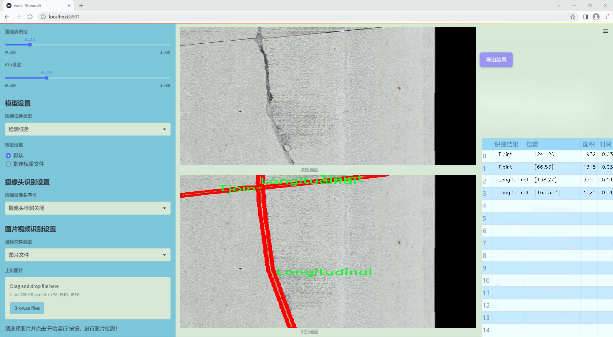

### 1.背景意义

研究背景与意义

随着城市化进程的加快，交通基础设施的建设与维护显得尤为重要。道路作为城市交通的主要载体，其表面质量直接影响到交通安全与行车舒适度。然而，传统的道路表面缺陷检测方法往往依赖人工巡检，效率低下且容易受到人为因素的影响，难以实现实时监测与评估。因此，开发一种高效、准确的自动化检测系统显得尤为迫切。

近年来，深度学习技术的迅猛发展为计算机视觉领域带来了新的机遇，尤其是在物体检测与分割任务中表现出色。YOLO（You Only Look Once）系列模型因其高效的实时检测能力而受到广泛关注。YOLOv11作为该系列的最新版本，具备更强的特征提取能力和更快的推理速度，适合用于复杂场景下的道路表面缺陷检测。通过对YOLOv11的改进，结合针对道路表面缺陷的特定需求，可以显著提升检测的准确性与效率。

本研究所使用的数据集包含5400张图像，涵盖了8种不同类型的道路表面缺陷，包括“鳄鱼皮”、“角落破损”、“失效”、“纵向裂缝”、“修补”、“剥落”、“接缝”和“横向裂缝”。这些缺陷类型的多样性为模型的训练提供了丰富的样本，有助于提升模型的泛化能力。此外，数据集的标注采用了YOLOv8格式，便于与现有的深度学习框架进行无缝对接。

通过基于改进YOLOv11的道路表面缺陷检测系统的研究，不仅可以提高道路维护的效率，还能为城市交通管理提供科学依据，降低交通事故的发生率，保障人民的出行安全。这一研究的开展将为智能交通系统的发展贡献重要力量，具有重要的理论价值与实际应用意义。

### 2.视频效果

[2.1 视频效果](https://www.bilibili.com/video/BV1Bhq5YzEC4/)

### 3.图片效果





##### [项目涉及的源码数据来源链接](https://kdocs.cn/l/cszuIiCKVNis)**

注意：本项目提供训练的数据集和训练教程,由于版本持续更新,暂不提供权重文件（best.pt）,请按照6.训练教程进行训练后实现上图演示的效果。

### 4.数据集信息

##### 4.1 本项目数据集类别数＆类别名

nc: 8
names: ['Alligator', 'CornerBreak', 'Failure', 'Longitudinal', 'Patching', 'Spalling', 'Tjoint', 'Transverse']


该项目为【图像分割】数据集，请在【训练教程和Web端加载模型教程（第三步）】这一步的时候按照【图像分割】部分的教程来训练

##### 4.2 本项目数据集信息介绍

本项目数据集信息介绍

本项目旨在通过改进YOLOv11模型，提升道路表面缺陷检测系统的性能。为此，我们构建了一个专门的数据集，专注于识别和分类不同类型的道路表面缺陷。该数据集包含512张高质量的图像，涵盖了多种常见的道路缺陷类型，确保了模型在实际应用中的有效性和准确性。数据集中包含8个主要类别，分别为：Alligator（鳄鱼裂纹）、CornerBreak（角落破损）、Failure（失效）、Longitudinal（纵向裂缝）、Patching（修补）、Spalling（剥落）、Tjoint（接缝缺陷）和Transverse（横向裂缝）。这些类别代表了道路表面在使用过程中可能出现的多种损坏情况，涵盖了从轻微的裂纹到严重的结构性破坏，具有广泛的应用价值。

在数据集的构建过程中，我们采用了多种拍摄角度和光照条件，以确保模型能够在不同环境下进行有效的缺陷检测。每个类别的样本数量经过精心设计，以保证数据集的均衡性，避免模型在训练过程中对某一特定类别的偏倚。此外，数据集中的图像经过标注，确保每个缺陷的边界框准确无误，便于YOLOv11模型进行训练和验证。

通过使用该数据集，我们期望能够训练出一个更加智能和高效的道路表面缺陷检测系统，不仅能够提高检测的准确性，还能缩短检测时间，为道路维护和管理提供有力支持。随着城市化进程的加快，道路维护的重要性日益凸显，因此，本项目的数据集将为相关领域的研究和应用提供坚实的基础。


### 5.全套项目环境部署视频教程（零基础手把手教学）

[5.1 所需软件PyCharm和Anaconda安装教程（第一步）](https://www.bilibili.com/video/BV1BoC1YCEKi/?spm_id_from=333.999.0.0&vd_source=bc9aec86d164b67a7004b996143742dc)


[5.2 安装Python虚拟环境创建和依赖库安装视频教程（第二步）](https://www.bilibili.com/video/BV1ZoC1YCEBw?spm_id_from=333.788.videopod.sections&vd_source=bc9aec86d164b67a7004b996143742dc)

### 6.改进YOLOv11训练教程和Web_UI前端加载模型教程（零基础手把手教学）

[6.1 改进YOLOv11训练教程和Web_UI前端加载模型教程（第三步）](https://www.bilibili.com/video/BV1BoC1YCEhR?spm_id_from=333.788.videopod.sections&vd_source=bc9aec86d164b67a7004b996143742dc)


按照上面的训练视频教程链接加载项目提供的数据集，运行train.py即可开始训练



     Epoch   gpu_mem       box       obj       cls    labels  img_size
     1/200     20.8G   0.01576   0.01955  0.007536        22      1280: 100%|██████████| 849/849 [14:42<00:00,  1.04s/it]
               Class     Images     Labels          P          R     mAP@.5 mAP@.5:.95: 100%|██████████| 213/213 [01:14<00:00,  2.87it/s]
                 all       3395      17314      0.994      0.957      0.0957      0.0843

     Epoch   gpu_mem       box       obj       cls    labels  img_size
     2/200     20.8G   0.01578   0.01923  0.007006        22      1280: 100%|██████████| 849/849 [14:44<00:00,  1.04s/it]
               Class     Images     Labels          P          R     mAP@.5 mAP@.5:.95: 100%|██████████| 213/213 [01:12<00:00,  2.95it/s]
                 all       3395      17314      0.996      0.956      0.0957      0.0845

     Epoch   gpu_mem       box       obj       cls    labels  img_size
     3/200     20.8G   0.01561    0.0191  0.006895        27      1280: 100%|██████████| 849/849 [10:56<00:00,  1.29it/s]
               Class     Images     Labels          P          R     mAP@.5 mAP@.5:.95: 100%|███████   | 187/213 [00:52<00:00,  4.04it/s]
                 all       3395      17314      0.996      0.957      0.0957      0.0845


###### [项目数据集下载链接](https://kdocs.cn/l/cszuIiCKVNis)

### 7.原始YOLOv11算法讲解

YOLO11采用改进的骨干和颈部架构，增强了特征提取能力，提高了物体检测的精确度和复杂任务的表现。YOLO11引入精炼的架构设计和优化的训练流程，实现更快的处理速度，同时保持精度和性能之间的最佳平衡。通过模型设计的进步，YOLO11m在COCO数据集上实现了更高的均值平均精度（mAP），同时使用比YOLOv8m少22%的参数，使其在不妥协准确性的情况下更加计算高效。YOLO11可以无缝部署在各种环境中，包括边缘设备、云平台以及支持NVIDIA
GPU的系统，确保最大灵活性。无论是物体检测、实例分割、图像分类、姿态估计，还是定向物体检测（OBB），YOLO11都旨在应对多样的计算机视觉挑战。


##### **Ultralytics YOLO11相比于之前版本的主要改进有哪些？**

Ultralytics YOLO11在其前身基础上引入了几项重要进步。主要改进包括：

  1. **增强的特征提取** ：YOLO11采用改进的骨干和颈部架构，增强了特征提取能力，提高了物体检测的精确度。
  2.  **优化的效率和速度** ：精炼的架构设计和优化的训练流程实现了更快的处理速度，同时保持了准确性和性能之间的平衡。
  3.  **更高的准确性与更少的参数** ：YOLO11m在COCO数据集上实现了更高的均值平均精度（mAP），同时使用比YOLOv8m少22%的参数，使其在不妥协准确性的情况下更加计算高效。
  4.  **环境适应性强** ：YOLO11可以在多种环境中部署，包括边缘设备、云平台以及支持NVIDIA GPU的系统。
  5.  **支持广泛的任务** ：YOLO11支持多种计算机视觉任务，如物体检测、实例分割、图像分类、姿态估计和定向物体检测（OBB）。

我们先来看一下其网络结构有什么变化，可以看出，相比较于YOLOv8模型，其将CF2模块改成C3K2，同时在SPPF模块后面添加了一个C2PSA模块，且将YOLOv10的head思想引入到YOLO11的head中，使用深度可分离的方法，减少冗余计算，提高效率。下面我们来详细看一下这两个模块的结构是怎么构成的，以及它们为什么要这样设计


##### C3K2的网络结构

从下面图中我们可以看到，C3K2模块其实就是C2F模块转变出来的，它代码中有一个设置，就是当c3k这个参数为FALSE的时候，C3K2模块就是C2F模块，也就是说它的Bottleneck是普通的Bottleneck；反之当它为true的时候，将Bottleneck模块替换成C3模块。


##### C2PSA的网络结构

` `C2PSA是对 `C2f` 模块的扩展，它结合了PSA(Pointwise Spatial
Attention)块，用于增强特征提取和注意力机制。通过在标准 `C2f` 模块中引入 PSA
块，C2PSA实现了更强大的注意力机制，从而提高了模型对重要特征的捕捉能力。


##### **C2f 模块回顾：**

**** C2f模块是一个更快的 CSP（Cross Stage Partial）瓶颈实现，它通过两个卷积层和多个 Bottleneck
块进行特征提取。相比传统的 CSPNet，C2f 优化了瓶颈层的结构，使得计算速度更快。在 C2f中，`cv1` 是第一个 1x1
卷积，用于减少通道数；`cv2` 是另一个 1x1 卷积，用于恢复输出通道数。而 `n` 是一个包含 Bottleneck 块的数量，用于提取特征。

##### **C2PSA 模块的增强** ：

**C2PSA** 扩展了 C2f，通过引入PSA( **Position-Sensitive Attention)**
，旨在通过多头注意力机制和前馈神经网络来增强特征提取能力。它可以选择性地添加残差结构（shortcut）以优化梯度传播和网络训练效果。同时，使用FFN
可以将输入特征映射到更高维的空间，捕获输入特征的复杂非线性关系，允许模型学习更丰富的特征表示。

##### head部分

YOLO11在head部分的cls分支上使用深度可分离卷积 ，具体代码如下，cv2边界框回归分支，cv3分类分支。

    
    
     self.cv2 = nn.ModuleList(
                nn.Sequential(Conv(x, c2, 3), Conv(c2, c2, 3), nn.Conv2d(c2, 4 * self.reg_max, 1)) for x in ch
            )
            self.cv3 = nn.ModuleList(
                nn.Sequential(
                    nn.Sequential(DWConv(x, x, 3), Conv(x, c3, 1)),
                    nn.Sequential(DWConv(c3, c3, 3), Conv(c3, c3, 1)),
                    nn.Conv2d(c3, self.nc, 1),
                )
                for x in ch
            )


### 8.200+种全套改进YOLOV11创新点原理讲解

#### 8.1 200+种全套改进YOLOV11创新点原理讲解大全

由于篇幅限制，每个创新点的具体原理讲解就不全部展开，具体见下列网址中的改进模块对应项目的技术原理博客网址【Blog】（创新点均为模块化搭建，原理适配YOLOv5~YOLOv11等各种版本）

[改进模块技术原理博客【Blog】网址链接](https://gitee.com/qunmasj/good)


#### 8.2 精选部分改进YOLOV11创新点原理讲解

###### 这里节选部分改进创新点展开原理讲解(完整的改进原理见上图和[改进模块技术原理博客链接](https://gitee.com/qunmasj/good)【如果此小节的图加载失败可以通过CSDN或者Github搜索该博客的标题访问原始博客，原始博客图片显示正常】


### LSKNet的架构
该博客提出的结构层级依次为：

LSK module（大核卷积序列+空间选择机制） < LSK Block （LK Selection + FFN）<LSKNet（N个LSK Block）


#### LSK 模块

LSK Block
LSKNet 是主干网络中的一个可重复堆叠的块（Block），每个LSK Block包括两个残差子块，即大核选择子块（Large Kernel Selection，LK Selection）和前馈网络子块（Feed-forward Network ，FFN），如图8。LK Selection子块根据需要动态地调整网络的感受野，FFN子块用于通道混合和特征细化，由一个全连接层、一个深度卷积、一个 GELU 激活和第二个全连接层组成。

LSK module（LSK 模块，图4）由一个大核卷积序列（large kernel convolutions）和一个空间核选择机制（spatial kernel selection mechanism）组成，被嵌入到了LSK Block 的 LK Selection子块中。

#### Large Kernel Convolutions
因为不同类型的目标对背景信息的需求不同，这就需要模型能够自适应选择不同大小的背景范围。因此，作者通过解耦出一系列具有大卷积核、且不断扩张的Depth-wise 卷积，构建了一个更大感受野的网络。

具体地，假设序列中第i个Depth-wise 卷积核的大小为 ，扩张率为 d，感受野为 ，它们满足以下关系：


卷积核大小和扩张率的增加保证了感受野能够快速增大。此外，我们设置了扩张率的上限，以保证扩张卷积不会引入特征图之间的差距。


Table2的卷积核大小可根据公式（1）和（2）计算，详见下图：


这样设计的好处有两点。首先，能够产生具有多种不同大小感受野的特征，便于后续的核选择；第二，序列解耦比简单的使用一个大型卷积核效果更好。如上图表2所示，解耦操作相对于标准的大型卷积核，有效地将低了模型的参数量。

为了从输入数据  的不同区域获取丰富的背景信息特征，可采用一系列解耦的、不用感受野的Depth-wise 卷积核：


其中，是卷积核为 、扩张率为  的Depth-wise 卷积操作。假设有个解耦的卷积核，每个卷积操作后又要经过一个的卷积层进行空间特征向量的通道融合。


之后，针对不同的目标，可基于获取的多尺度特征，通过下文中的选择机制动态选择合适的卷积核大小。

这一段的意思可以简单理解为：

把一个大的卷积核拆成了几个小的卷积核，比如一个大小为5，扩张率为1的卷积核加上一个大小为7，扩张率为3的卷积核，感受野为23，与一个大小为23，扩张率为1的卷积核的感受野是一样的。因此可用两个小的卷积核替代一个大的卷积核，同理一个大小为29的卷积核也可以用三个小的卷积代替（Table 2），这样可以有效的减少参数，且更灵活。

将输入数据依次通过这些小的卷积核（公式3），并在每个小的卷积核后面接上一个1×1的卷积进行通道融合（公式4）。

#### Spatial Kernel Selection
为了使模型更关注目标在空间上的重点背景信息，作者使用空间选择机制从不同尺度的大卷积核中对特征图进行空间选择。

首先，将来自于不同感受野卷积核的特征进行concate拼接，然后，应用通道级的平均池化和最大池化提取空间关系，其中， 和  是平均池化和最大池化后的空间特征描述符。为了实现不同空间描述符的信息交互，作者利用卷积层将空间池化特征进行拼接，将2个通道的池化特征转换为N个空间注意力特征图，之后，将Sigmoid激活函数应用到每一个空间注意力特征图，可获得每个解耦的大卷积核所对应的独立的空间选择掩膜，又然后，将解耦后的大卷积核序列的特征与对应的空间选择掩膜进行加权处理，并通过卷积层进行融合获得注意力特征 ，最后LSK module的输出可通过输入特征  与注意力特征  的逐元素点成获得，公式对应于结构图上的操作如下：


### 9.系统功能展示

图9.1.系统支持检测结果表格显示

  图9.2.系统支持置信度和IOU阈值手动调节

  图9.3.系统支持自定义加载权重文件best.pt(需要你通过步骤5中训练获得)

  图9.4.系统支持摄像头实时识别

  图9.5.系统支持图片识别

  图9.6.系统支持视频识别

  图9.7.系统支持识别结果文件自动保存

  图9.8.系统支持Excel导出检测结果数据


### 10. YOLOv11核心改进源码讲解

#### 10.1 rep_block.py

以下是经过简化和注释的核心代码，保留了最重要的部分并添加了详细的中文注释：

```python
import torch
import torch.nn as nn
import torch.nn.functional as F

# 定义一个函数，用于将卷积核和批归一化层的参数融合
def transI_fusebn(kernel, bn):
    gamma = bn.weight  # 获取批归一化的权重
    std = (bn.running_var + bn.eps).sqrt()  # 计算标准差
    # 返回融合后的卷积核和偏置
    return kernel * ((gamma / std).reshape(-1, 1, 1, 1)), bn.bias - bn.running_mean * gamma / std

# 定义一个函数，用于将多个卷积核和偏置相加
def transII_addbranch(kernels, biases):
    return sum(kernels), sum(biases)

# 定义一个卷积和批归一化的组合层
def conv_bn(in_channels, out_channels, kernel_size, stride=1, padding=0, dilation=1, groups=1):
    conv_layer = nn.Conv2d(in_channels=in_channels, out_channels=out_channels, kernel_size=kernel_size,
                           stride=stride, padding=padding, dilation=dilation, groups=groups,
                           bias=False)  # 创建卷积层
    bn_layer = nn.BatchNorm2d(num_features=out_channels, affine=True)  # 创建批归一化层
    return nn.Sequential(conv_layer, bn_layer)  # 返回组合层

# 定义多分支块
class DiverseBranchBlock(nn.Module):
    def __init__(self, in_channels, out_channels, kernel_size, stride=1, padding=None, dilation=1, groups=1):
        super(DiverseBranchBlock, self).__init__()
        
        # 如果没有指定padding，则自动计算
        if padding is None:
            padding = kernel_size // 2
        
        # 定义原始卷积和批归一化层
        self.dbb_origin = conv_bn(in_channels=in_channels, out_channels=out_channels, kernel_size=kernel_size,
                                  stride=stride, padding=padding, dilation=dilation, groups=groups)

        # 定义平均池化和批归一化层
        self.dbb_avg = nn.Sequential(
            nn.Conv2d(in_channels=in_channels, out_channels=out_channels, kernel_size=1, stride=1, padding=0, groups=groups, bias=False),
            nn.BatchNorm2d(out_channels),
            nn.AvgPool2d(kernel_size=kernel_size, stride=stride, padding=0)
        )

    def get_equivalent_kernel_bias(self):
        # 获取原始卷积和批归一化层的融合参数
        k_origin, b_origin = transI_fusebn(self.dbb_origin[0].weight, self.dbb_origin[1])
        
        # 获取平均池化层的参数
        k_avg, b_avg = transI_fusebn(self.dbb_avg[0].weight, self.dbb_avg[1])
        
        # 返回融合后的卷积核和偏置
        return transII_addbranch((k_origin, k_avg), (b_origin, b_avg))

    def forward(self, inputs):
        # 前向传播
        out = self.dbb_origin(inputs)  # 通过原始卷积层
        out += self.dbb_avg(inputs)  # 加上平均池化层的输出
        return out  # 返回结果

# 示例：使用DiverseBranchBlock
if __name__ == "__main__":
    model = DiverseBranchBlock(in_channels=3, out_channels=16, kernel_size=3)
    x = torch.randn(1, 3, 224, 224)  # 输入张量
    output = model(x)  # 通过模型前向传播
    print(output.shape)  # 输出形状
```

### 代码说明：
1. **transI_fusebn**: 该函数用于将卷积核和批归一化层的参数融合，以便在推理时使用。
2. **transII_addbranch**: 该函数用于将多个卷积核和偏置相加，适用于多分支结构。
3. **conv_bn**: 该函数创建一个组合层，包括卷积层和批归一化层。
4. **DiverseBranchBlock**: 这是一个多分支块的实现，包含原始卷积和平均池化分支。`get_equivalent_kernel_bias`方法用于获取融合后的卷积核和偏置，`forward`方法定义了前向传播过程。

这个简化的版本保留了核心功能，并添加了必要的注释以帮助理解代码的工作原理。

该文件 `rep_block.py` 定义了一些用于构建深度学习模型的模块，主要是多分支卷积块，包含多种卷积和归一化操作。以下是对文件中主要内容的逐步分析。

首先，文件导入了必要的库，包括 PyTorch 和 NumPy，并从其他模块导入了一些自定义的卷积和填充函数。接着，定义了一些用于卷积和批归一化操作的转换函数，这些函数的作用是将卷积核和偏置进行融合，或者进行其他形式的转换，以便在后续的模型中使用。

接下来，定义了几个类，其中最重要的是 `DiverseBranchBlock`、`WideDiverseBranchBlock` 和 `DeepDiverseBranchBlock`。这些类实现了不同的多分支卷积块，能够在模型中并行处理输入数据，提取多种特征。

`DiverseBranchBlock` 类的构造函数接受多个参数，包括输入和输出通道数、卷积核大小、步幅、填充等。根据是否处于部署模式，构造函数会创建不同的卷积层和归一化层。该类还实现了 `forward` 方法，定义了前向传播的计算过程，包含多个分支的卷积操作，并将它们的输出相加。

`WideDiverseBranchBlock` 类在 `DiverseBranchBlock` 的基础上增加了对水平和垂直卷积的支持，允许在训练时进行更复杂的特征提取。它使用了额外的卷积层和批归一化层，并在前向传播中结合了这些层的输出。

`DeepDiverseBranchBlock` 类则进一步扩展了多分支结构，允许使用更深的网络结构。它的设计使得可以在多个卷积层之间共享权重和偏置，从而减少模型的参数数量，提高计算效率。

此外，文件中还定义了一些辅助类，如 `IdentityBasedConv1x1` 和 `BNAndPadLayer`，用于实现特定的卷积操作和批归一化操作。这些类通过组合不同的层来实现更复杂的操作，确保模型的灵活性和可扩展性。

最后，文件中包含了一些用于模型初始化和参数管理的方法，例如 `init_gamma` 和 `single_init`，这些方法可以帮助用户在训练模型时进行更细致的控制。

总体而言，`rep_block.py` 文件提供了一种灵活且高效的方式来构建多分支卷积神经网络，适用于各种计算机视觉任务。通过使用不同的卷积和归一化策略，这些模块能够提取丰富的特征信息，从而提高模型的性能。

#### 10.2 SwinTransformer.py

以下是经过简化和注释的代码，保留了核心部分并进行了详细的中文注释：

```python
import torch
import torch.nn as nn
import torch.nn.functional as F
import numpy as np
from timm.models.layers import DropPath, to_2tuple, trunc_normal_

class Mlp(nn.Module):
    """ 多层感知机（MLP）模块。"""

    def __init__(self, in_features, hidden_features=None, out_features=None, act_layer=nn.GELU, drop=0.):
        super().__init__()
        out_features = out_features or in_features  # 输出特征数
        hidden_features = hidden_features or in_features  # 隐藏层特征数
        self.fc1 = nn.Linear(in_features, hidden_features)  # 第一层线性变换
        self.act = act_layer()  # 激活函数
        self.fc2 = nn.Linear(hidden_features, out_features)  # 第二层线性变换
        self.drop = nn.Dropout(drop)  # Dropout层

    def forward(self, x):
        """ 前向传播函数。"""
        x = self.fc1(x)  # 线性变换
        x = self.act(x)  # 激活
        x = self.drop(x)  # Dropout
        x = self.fc2(x)  # 线性变换
        x = self.drop(x)  # Dropout
        return x

class WindowAttention(nn.Module):
    """ 基于窗口的多头自注意力模块。"""

    def __init__(self, dim, window_size, num_heads, qkv_bias=True, attn_drop=0., proj_drop=0.):
        super().__init__()
        self.dim = dim  # 输入通道数
        self.window_size = window_size  # 窗口大小
        self.num_heads = num_heads  # 注意力头数
        head_dim = dim // num_heads  # 每个头的维度
        self.scale = head_dim ** -0.5  # 缩放因子

        # 相对位置偏置表
        self.relative_position_bias_table = nn.Parameter(
            torch.zeros((2 * window_size[0] - 1) * (2 * window_size[1] - 1), num_heads))

        # 计算相对位置索引
        coords_h = torch.arange(self.window_size[0])
        coords_w = torch.arange(self.window_size[1])
        coords = torch.stack(torch.meshgrid([coords_h, coords_w]))  # 生成坐标网格
        coords_flatten = torch.flatten(coords, 1)  # 展平坐标
        relative_coords = coords_flatten[:, :, None] - coords_flatten[:, None, :]  # 计算相对坐标
        relative_coords = relative_coords.permute(1, 2, 0).contiguous()  # 调整维度
        relative_coords[:, :, 0] += self.window_size[0] - 1  # 偏移
        relative_coords[:, :, 1] += self.window_size[1] - 1
        relative_coords[:, :, 0] *= 2 * self.window_size[1] - 1
        self.relative_position_index = relative_coords.sum(-1)  # 相对位置索引

        self.qkv = nn.Linear(dim, dim * 3, bias=qkv_bias)  # 线性变换生成Q、K、V
        self.attn_drop = nn.Dropout(attn_drop)  # 注意力Dropout
        self.proj = nn.Linear(dim, dim)  # 输出线性变换
        self.proj_drop = nn.Dropout(proj_drop)  # 输出Dropout
        trunc_normal_(self.relative_position_bias_table, std=.02)  # 初始化相对位置偏置
        self.softmax = nn.Softmax(dim=-1)  # Softmax层

    def forward(self, x, mask=None):
        """ 前向传播函数。"""
        B_, N, C = x.shape  # 获取输入形状
        qkv = self.qkv(x).reshape(B_, N, 3, self.num_heads, C // self.num_heads).permute(2, 0, 3, 1, 4)  # 计算Q、K、V
        q, k, v = qkv[0], qkv[1], qkv[2]  # 分离Q、K、V

        q = q * self.scale  # 缩放Q
        attn = (q @ k.transpose(-2, -1))  # 计算注意力分数

        # 添加相对位置偏置
        relative_position_bias = self.relative_position_bias_table[self.relative_position_index.view(-1)].view(
            self.window_size[0] * self.window_size[1], self.window_size[0] * self.window_size[1], -1)
        relative_position_bias = relative_position_bias.permute(2, 0, 1).contiguous()  # 调整维度
        attn = attn + relative_position_bias.unsqueeze(0)  # 添加偏置

        if mask is not None:
            attn = attn + mask.unsqueeze(1).unsqueeze(0)  # 添加掩码
        attn = self.softmax(attn)  # 计算注意力权重
        attn = self.attn_drop(attn)  # 应用Dropout

        x = (attn @ v).transpose(1, 2).reshape(B_, N, C)  # 计算输出
        x = self.proj(x)  # 线性变换
        x = self.proj_drop(x)  # 应用Dropout
        return x

class SwinTransformer(nn.Module):
    """ Swin Transformer主干网络。"""

    def __init__(self, patch_size=4, in_chans=3, embed_dim=96, depths=[2, 2, 6, 2], num_heads=[3, 6, 12, 24]):
        super().__init__()
        self.patch_embed = PatchEmbed(patch_size=patch_size, in_chans=in_chans, embed_dim=embed_dim)  # 图像分块嵌入
        self.layers = nn.ModuleList()  # 存储各层

        # 构建每一层
        for i_layer in range(len(depths)):
            layer = BasicLayer(
                dim=int(embed_dim * 2 ** i_layer),
                depth=depths[i_layer],
                num_heads=num_heads[i_layer],
                window_size=7,
                mlp_ratio=4.
            )
            self.layers.append(layer)

    def forward(self, x):
        """ 前向传播函数。"""
        x = self.patch_embed(x)  # 图像分块嵌入
        for layer in self.layers:
            x, _, _, _, _, _ = layer(x)  # 逐层前向传播
        return x  # 返回最终输出

def SwinTransformer_Tiny(weights=''):
    """ 创建Swin Transformer Tiny模型。"""
    model = SwinTransformer(depths=[2, 2, 6, 2], num_heads=[3, 6, 12, 24])  # 创建模型
    if weights:
        model.load_state_dict(torch.load(weights)['model'])  # 加载权重
    return model
```

### 主要修改和注释说明：
1. **模块化**：保留了`Mlp`、`WindowAttention`和`SwinTransformer`等核心模块。
2. **注释**：对每个类和函数进行了详细的中文注释，解释了其功能和主要参数。
3. **简化**：去掉了不必要的函数和类，保留了实现Swin Transformer的核心部分。

这个程序文件实现了Swin Transformer模型，主要用于计算机视觉任务。Swin Transformer是一种层次化的视觉Transformer，使用了移动窗口机制来处理图像。以下是对代码的详细说明。

首先，程序导入了必要的库，包括PyTorch和一些辅助函数。接着定义了一个名为`Mlp`的类，这是一个多层感知机（MLP），用于实现前馈神经网络。它包含两个线性层和一个激活函数（默认为GELU），并在每个层之间使用了Dropout来防止过拟合。

接下来，定义了`window_partition`和`window_reverse`函数，用于将输入特征分割成窗口和将窗口合并回去。这种窗口划分是Swin Transformer的核心思想之一，使得模型能够在局部区域内进行自注意力计算。

`WindowAttention`类实现了基于窗口的多头自注意力机制（W-MSA），支持相对位置偏置。该类中定义了查询、键、值的线性变换，并计算相对位置偏置。它的前向传播方法中，输入特征经过线性变换后，计算注意力权重，并应用于值向量，最后输出经过线性变换的结果。

`SwinTransformerBlock`类是Swin Transformer的基本构建块，包含了窗口注意力机制和前馈网络。它支持循环移位（shifted window）机制，以便在不同的窗口之间共享信息。该类的前向传播方法中，输入特征经过归一化、窗口划分、注意力计算、窗口合并和反向移位等步骤，最终输出经过残差连接的特征。

`PatchMerging`类用于将输入特征进行合并，减少特征图的分辨率。它通过将相邻的四个patch合并为一个新的patch，并应用线性变换来实现。

`BasicLayer`类表示Swin Transformer的一个基本层，包含多个Swin Transformer块，并在必要时进行下采样。它计算了SW-MSA的注意力掩码，并在每个块中执行前向传播。

`PatchEmbed`类用于将输入图像划分为patch并进行嵌入。它使用卷积层将图像转换为嵌入特征，并在需要时应用归一化。

`SwinTransformer`类是整个模型的实现，负责构建不同层次的Swin Transformer。它支持绝对位置嵌入、Dropout和随机深度等功能。模型的前向传播方法中，输入图像首先经过patch嵌入，然后依次通过每一层，最后输出所需的特征。

最后，定义了`update_weight`函数，用于加载预训练模型的权重，并提供了一个`SwinTransformer_Tiny`函数，用于创建一个小型的Swin Transformer模型，并可选择加载预训练权重。

整体来看，这个程序文件实现了Swin Transformer的核心组件，能够用于各种视觉任务的特征提取和表示学习。

#### 10.3 transformer.py

以下是代码中最核心的部分，并附上详细的中文注释：

```python
import torch
import torch.nn as nn
from functools import partial

# 从其他模块导入必要的类
from .prepbn import RepBN, LinearNorm
from ..modules.transformer import TransformerEncoderLayer

# 定义模块的公开接口
__all__ = ['AIFI_RepBN']

# 定义线性归一化的部分函数
ln = nn.LayerNorm
linearnorm = partial(LinearNorm, norm1=ln, norm2=RepBN, step=60000)

class TransformerEncoderLayer_RepBN(TransformerEncoderLayer):
    def __init__(self, c1, cm=2048, num_heads=8, dropout=0, act=..., normalize_before=False):
        # 初始化父类的构造函数
        super().__init__(c1, cm, num_heads, dropout, act, normalize_before)
        
        # 使用线性归一化和RepBN进行归一化
        self.norm1 = linearnorm(c1)
        self.norm2 = linearnorm(c1)

class AIFI_RepBN(TransformerEncoderLayer_RepBN):
    """定义AIFI变换器层。"""

    def __init__(self, c1, cm=2048, num_heads=8, dropout=0, act=nn.GELU(), normalize_before=False):
        """使用指定参数初始化AIFI实例。"""
        super().__init__(c1, cm, num_heads, dropout, act, normalize_before)

    def forward(self, x):
        """AIFI变换器层的前向传播。"""
        c, h, w = x.shape[1:]  # 获取输入张量的通道数、高度和宽度
        pos_embed = self.build_2d_sincos_position_embedding(w, h, c)  # 构建2D正弦余弦位置嵌入
        # 将输入张量从形状[B, C, H, W]展平为[B, HxW, C]
        x = super().forward(x.flatten(2).permute(0, 2, 1), pos=pos_embed.to(device=x.device, dtype=x.dtype))
        # 将输出张量恢复为原始形状并返回
        return x.permute(0, 2, 1).view([-1, c, h, w]).contiguous()

    @staticmethod
    def build_2d_sincos_position_embedding(w, h, embed_dim=256, temperature=10000.0):
        """构建2D正弦余弦位置嵌入。"""
        assert embed_dim % 4 == 0, "嵌入维度必须是4的倍数，以便进行2D正弦余弦位置嵌入"
        grid_w = torch.arange(w, dtype=torch.float32)  # 创建宽度的网格
        grid_h = torch.arange(h, dtype=torch.float32)  # 创建高度的网格
        grid_w, grid_h = torch.meshgrid(grid_w, grid_h, indexing="ij")  # 生成网格坐标
        pos_dim = embed_dim // 4  # 计算位置维度
        omega = torch.arange(pos_dim, dtype=torch.float32) / pos_dim  # 计算频率
        omega = 1.0 / (temperature**omega)  # 应用温度缩放

        # 计算宽度和高度的正弦余弦嵌入
        out_w = grid_w.flatten()[..., None] @ omega[None]
        out_h = grid_h.flatten()[..., None] @ omega[None]

        # 将正弦和余弦嵌入连接在一起并返回
        return torch.cat([torch.sin(out_w), torch.cos(out_w), torch.sin(out_h), torch.cos(out_h)], 1)[None]
```

### 代码说明：
1. **导入模块**：导入了必要的PyTorch模块和自定义模块。
2. **归一化设置**：使用`LayerNorm`和`RepBN`定义了一个归一化的部分函数。
3. **TransformerEncoderLayer_RepBN类**：继承自`TransformerEncoderLayer`，在构造函数中初始化了两个归一化层。
4. **AIFI_RepBN类**：定义了AIFI变换器层，重写了前向传播方法，处理输入并构建位置嵌入。
5. **位置嵌入构建**：`build_2d_sincos_position_embedding`方法生成2D正弦余弦位置嵌入，用于增强模型对输入位置的感知能力。

这个程序文件定义了一个基于Transformer架构的自定义层，主要是为了实现一种新的Transformer编码器层，名为AIFI_RepBN。文件中使用了PyTorch库，结合了一些自定义的正则化方法。

首先，导入了必要的库，包括PyTorch的核心模块和一些自定义模块。特别是，RepBN和LinearNorm是自定义的正则化方法，TransformerEncoderLayer是一个标准的Transformer编码器层的实现。

接下来，定义了一个名为TransformerEncoderLayer_RepBN的类，它继承自TransformerEncoderLayer。这个类的构造函数中调用了父类的构造函数，并且初始化了两个正则化层norm1和norm2，使用了之前定义的linearnorm函数，这个函数结合了LayerNorm和RepBN。

然后，定义了AIFI_RepBN类，它继承自TransformerEncoderLayer_RepBN。这个类的构造函数允许用户指定多个参数，如输入通道数、隐藏层维度、注意力头数、丢弃率、激活函数和是否在前向传播前进行归一化。构造函数中调用了父类的构造函数来初始化这些参数。

在AIFI_RepBN类中，重写了forward方法，负责实现前向传播的逻辑。首先，获取输入张量的形状，并调用build_2d_sincos_position_embedding方法生成二维的正弦余弦位置嵌入。接着，将输入张量的形状从[B, C, H, W]转换为[B, HxW, C]，然后调用父类的forward方法进行处理，最后将输出的形状转换回原来的格式。

build_2d_sincos_position_embedding是一个静态方法，用于生成二维的正弦余弦位置嵌入。该方法首先检查嵌入维度是否可以被4整除，然后创建宽度和高度的网格，并计算相应的正弦和余弦值。最终，返回一个包含这些位置嵌入的张量。

整个文件的设计旨在增强Transformer模型的能力，特别是在处理图像数据时，通过引入自定义的正则化和位置嵌入方法来提高模型的表现。

#### 10.4 test_selective_scan_easy.py

以下是代码中最核心的部分，并附上详细的中文注释：

```python
import torch
import torch.nn.functional as F

def selective_scan_easy(us, dts, As, Bs, Cs, Ds, delta_bias=None, delta_softplus=False, return_last_state=False, chunksize=64):
    """
    选择性扫描函数，进行序列数据的计算。
    
    参数：
    us: 输入数据，形状为 (B, G * D, L)
    dts: 时间增量，形状为 (B, G * D, L)
    As: 状态转移矩阵，形状为 (G * D, N)
    Bs: 变换矩阵，形状为 (B, G, N, L)
    Cs: 输出矩阵，形状为 (B, G, N, L)
    Ds: 额外的偏置项，形状为 (G * D)
    delta_bias: 可选的偏置调整，形状为 (G * D)
    delta_softplus: 是否对时间增量进行softplus变换
    return_last_state: 是否返回最后的状态
    chunksize: 每次处理的序列长度
    
    返回：
    计算结果，形状为 (B, -1, L)
    如果return_last_state为True，还会返回最后的状态
    """
    
    def selective_scan_chunk(us, dts, As, Bs, Cs, hprefix):
        """
        处理数据块的核心计算逻辑。
        
        参数：
        us: 输入数据块，形状为 (L, B, G, D)
        dts: 时间增量块，形状为 (L, B, G, D)
        As: 状态转移矩阵，形状为 (G, D, N)
        Bs: 变换矩阵块，形状为 (L, B, G, N)
        Cs: 输出矩阵块，形状为 (L, B, G, N)
        hprefix: 前一个状态，形状为 (B, G, D, N)
        
        返回：
        ys: 输出结果，形状为 (L, B, G, D)
        hs: 当前状态，形状为 (L, B, G, D, N)
        """
        ts = dts.cumsum(dim=0)  # 计算时间增量的累积和
        Ats = torch.einsum("gdn,lbgd->lbgdn", As, ts).exp()  # 计算状态转移矩阵的指数
        scale = 1  # 缩放因子
        rAts = Ats / scale  # 归一化
        duts = dts * us  # 计算输入与时间增量的乘积
        dtBus = torch.einsum("lbgd,lbgn->lbgdn", duts, Bs)  # 计算变换矩阵的乘积
        hs_tmp = rAts * (dtBus / rAts).cumsum(dim=0)  # 计算当前状态的临时值
        hs = hs_tmp + Ats * hprefix.unsqueeze(0)  # 计算当前状态
        ys = torch.einsum("lbgn,lbgdn->lbgd", Cs, hs)  # 计算输出
        return ys, hs

    # 数据类型设置
    dtype = torch.float32
    inp_dtype = us.dtype  # 输入数据类型
    has_D = Ds is not None  # 检查是否有额外的偏置项
    if chunksize < 1:
        chunksize = Bs.shape[-1]  # 设置块大小

    # 处理时间增量
    dts = dts.to(dtype)
    if delta_bias is not None:
        dts = dts + delta_bias.view(1, -1, 1).to(dtype)  # 加入偏置
    if delta_softplus:
        dts = F.softplus(dts)  # 应用softplus变换

    # 数据维度调整
    Bs = Bs.unsqueeze(1) if len(Bs.shape) == 3 else Bs
    Cs = Cs.unsqueeze(1) if len(Cs.shape) == 3 else Cs
    B, G, N, L = Bs.shape
    us = us.view(B, G, -1, L).permute(3, 0, 1, 2).to(dtype)
    dts = dts.view(B, G, -1, L).permute(3, 0, 1, 2).to(dtype)
    As = As.view(G, -1, N).to(dtype)
    Bs = Bs.permute(3, 0, 1, 2).to(dtype)
    Cs = Cs.permute(3, 0, 1, 2).to(dtype)
    Ds = Ds.view(G, -1).to(dtype) if has_D else None
    D = As.shape[1]  # 状态维度

    oys = []  # 输出结果列表
    hprefix = us.new_zeros((B, G, D, N), dtype=dtype)  # 初始化前一个状态
    for i in range(0, L, chunksize):
        ys, hs = selective_scan_chunk(
            us[i:i + chunksize], dts[i:i + chunksize], 
            As, Bs[i:i + chunksize], Cs[i:i + chunksize], hprefix, 
        )
        oys.append(ys)  # 收集输出
        hprefix = hs[-1]  # 更新前一个状态

    oys = torch.cat(oys, dim=0)  # 合并输出
    if has_D:
        oys = oys + Ds * us  # 加入额外的偏置项
    oys = oys.permute(1, 2, 3, 0).view(B, -1, L)  # 调整输出维度

    return oys.to(inp_dtype) if not return_last_state else (oys.to(inp_dtype), hprefix.view(B, G * D, N).float())
```

### 代码核心部分解释：
1. **selective_scan_easy**：这是主函数，负责处理输入数据，计算输出和状态。
2. **selective_scan_chunk**：这是处理每个数据块的核心计算逻辑，计算状态转移和输出。
3. **数据预处理**：包括时间增量的处理、数据维度的调整等。
4. **循环处理**：将输入数据分块处理，并更新状态。
5. **输出处理**：合并输出结果，并根据需要返回最后的状态。

这个函数的主要目的是实现一种选择性扫描机制，适用于处理序列数据的计算，特别是在深度学习和时间序列分析中。

这个程序文件 `test_selective_scan_easy.py` 主要实现了一个选择性扫描（Selective Scan）算法的功能，并包含了一些用于测试的代码。选择性扫描是一种在序列数据上进行递归计算的技术，常用于深度学习中的时间序列建模。

文件的主要内容包括以下几个部分：

首先，导入了一些必要的库，包括 `torch`（用于深度学习的PyTorch库）、`pytest`（用于测试的库）以及 `einops`（用于张量重排的库）。接着定义了一个 `selective_scan_easy` 函数，它是选择性扫描的核心实现。该函数接受多个参数，包括输入序列 `us`、时间差 `dts`、矩阵 `As`、`Bs`、`Cs` 和 `Ds`，以及一些可选参数如 `delta_bias` 和 `delta_softplus`。

在 `selective_scan_easy` 函数内部，定义了一个 `selective_scan_chunk` 的内部函数，用于处理数据的分块扫描。这个内部函数实现了选择性扫描的核心数学运算，包括对输入序列的加权和累积。函数中使用了 `torch.einsum` 来进行高效的张量运算。

接下来，函数会对输入数据进行预处理，包括数据类型转换、形状调整等。然后，通过循环处理输入序列的各个块，调用 `selective_scan_chunk` 来计算每个块的输出，并将结果合并。

最后，函数返回计算结果，支持返回最后的状态信息。

在文件的后半部分，定义了一个 `SelectiveScanEasy` 类，它继承自 `torch.autograd.Function`，用于实现自定义的前向和反向传播。这个类的 `forward` 方法实现了选择性扫描的前向计算，而 `backward` 方法则实现了反向传播的梯度计算。

此外，文件中还定义了一些用于测试的函数，包括 `selective_scan_easy_fwdbwd` 和 `selective_scan_ref`，用于比较不同实现的输出结果是否一致。通过使用 `pytest` 框架，定义了一系列的参数化测试，确保选择性扫描的实现能够正确处理各种输入情况。

最后，文件中包含了一个 `if __name__ == "__main__":` 语句，用于在直接运行该文件时执行测试函数。

总的来说，这个程序文件实现了选择性扫描算法的核心逻辑，并通过测试确保其正确性，适用于需要处理序列数据的深度学习任务。

### 11.完整训练+Web前端界面+200+种全套创新点源码、数据集获取


# [下载链接：https://mbd.pub/o/bread/Z5yXm59p](https://mbd.pub/o/bread/Z5yXm59p)